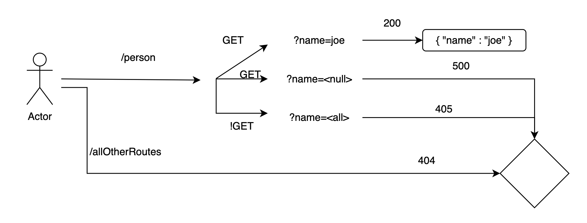

# basic-express-server

Basic express server, with testing


## Live Deployments
- XXX FIX BELOW XXX
- [main branch deployment](https://basic-express-server-with-tests.onrender.com)
- [This is the PR link](https://github.com/0xQuasark/basic-express-server/pull/2) from `dev` to `main`

## UML Design



## Installation

* `npm install`

Set your PORT environment with an .env file

```text
PORT=3001
```

## Usage

Send a request:

```text
method: GET
route: /person
params:
  name{String}
```

## Contributors

- Jacob Knaack (original author)
- Paul Brown (additional lab work)

